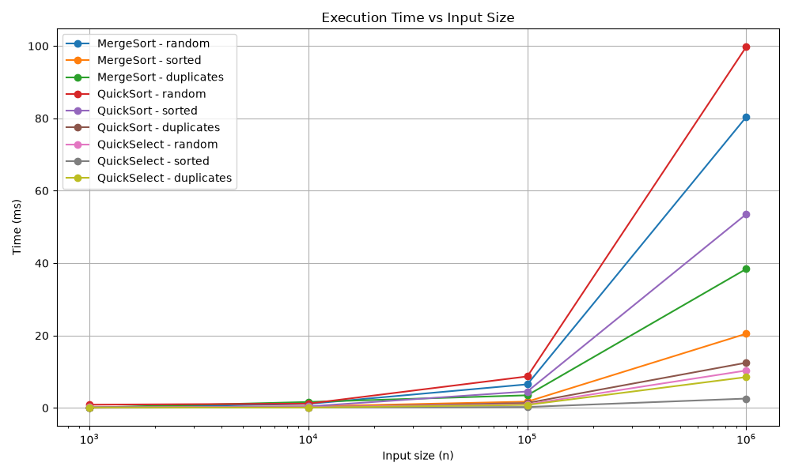
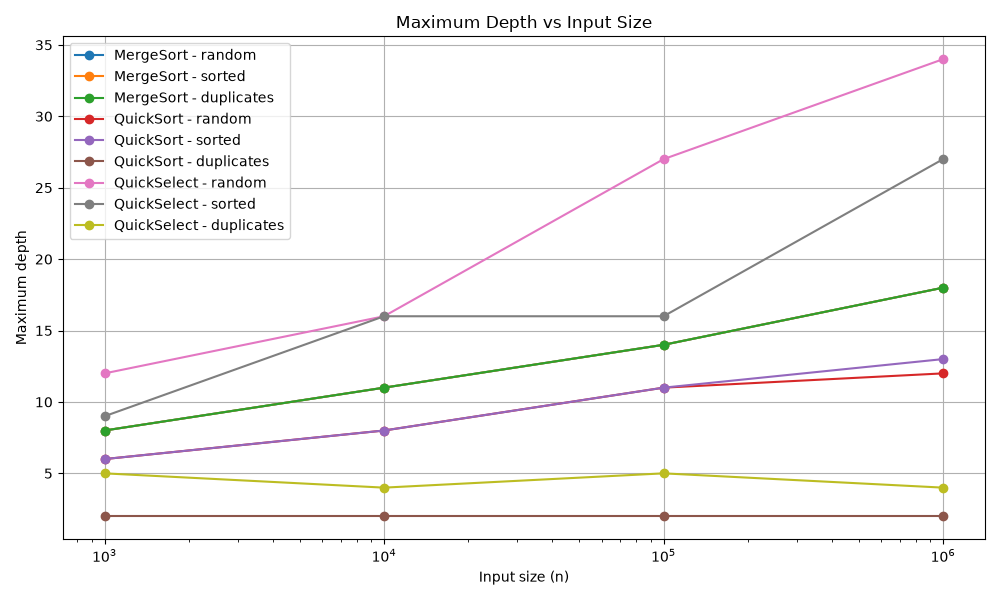
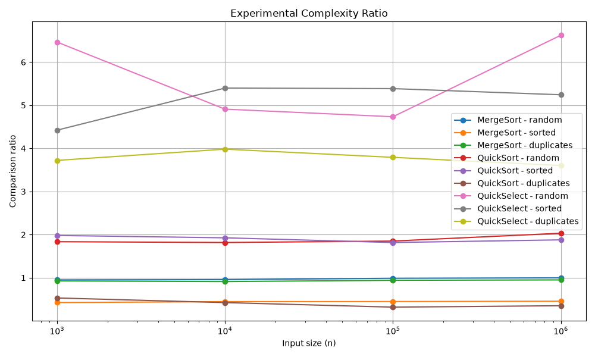

# Assignment 1 - Divide and Conquer & Asymptotic Notations

**Student:** Demeuov Bekzat  
**Group:** SE-2542

## Introduction

In this assignment I implemented three algorithms in Java: MergeSort, QuickSort and QuickSelect. I tested them on random, sorted and duplicate arrays.

For every algorithm I measured execution time, number of comparisons and depth. Every test was repeated 5 times and the median time was saved to results.csv.

## Asymptotic Analysis

| Algorithm | Best | Average | Worst |
|---|---|---|---|
| MergeSort | Θ(n log n) | Θ(n log n) | Θ(n log n) |
| QuickSort | Θ(n) with many equal values | Θ(n log n) | O(n²) |
| QuickSelect | Θ(n) | Θ(n) | O(n²) |
| Insertion Sort | Θ(n) | Θ(n²) | Θ(n²) |

MergeSort always divides the array into two parts, so its complexity is Θ(n log n).

QuickSort usually works in Θ(n log n). Random pivot helps avoid bad partitions. With many duplicates, 3-way partition makes it faster. The worst case is O(n²) when partitions are repeatedly very unbalanced.

QuickSelect usually works in Θ(n) because after partitioning it continues only with the part that contains k.

Insertion Sort is Θ(n) on sorted data and Θ(n²) on average and in the worst case.

## Recurrence Relations

### MergeSort

T(n) = 2T(n/2) + Θ(n)

a = 2, b = 2, f(n) = n.

By Master Theorem, this is Case 2.

Result: **Θ(n log n)**.

### QuickSort

For balanced partitions:

T(n) = 2T(n/2) + Θ(n)

By Master Theorem, this is Case 2.

Result: **Θ(n log n)**.

A random pivot makes very bad partitions less likely, so the average running time is O(n log n).

### QuickSelect

For a balanced partition:

T(n) = T(n/2) + Θ(n)

a = 1, b = 2, f(n) = n.

By Master Theorem, this is Case 3.

Result: **Θ(n)**.

## Results

I tested the algorithms with:

- n = 1,000
- n = 10,000
- n = 100,000
- n = 1,000,000

I used random, sorted and duplicate arrays.

### Time

The execution time increases when n becomes larger. QuickSelect was usually faster because it does not sort the whole array.

### Maximum Depth

MergeSort depth grows because the array is divided recursively.

QuickSort keeps a small depth because it recursively processes the smaller part and uses a loop for the larger part. On duplicate arrays its depth was especially small because of 3-way partition.

### Ratio

For MergeSort and QuickSort I used:

comparisons / (n * log2(n))

For QuickSelect I used:

comparisons / n

The ratios for large inputs stay in a similar range, which generally matches the expected complexity.

## Theta Check

For MergeSort on large random arrays, the ratio was approximately 0.99-1.00.

So for the measured data I can use approximately:

c1 = 0.9  
c2 = 1.1  
n0 = 100,000

This gives:

0.9 * n log2(n) <= comparisons <= 1.1 * n log2(n)

For QuickSelect the ratio changes more because the pivot is random. For the large random inputs it was approximately between 4.7 and 6.6.

These values are experimental results, not a mathematical proof.

## Discussion

The results mostly match the theory. MergeSort shows n log n growth. QuickSort also works well on random and sorted arrays because it uses a random pivot. It works especially well with duplicates because of 3-way partition. QuickSelect is faster because it only continues in the part where k is located. The measured time can be affected by JVM warm-up, Garbage Collector and CPU cache. The Insertion Sort cutoff also helps MergeSort with small subarrays. Using the median of 5 runs makes the results more stable.

## Conclusion

In this assignment I implemented and tested MergeSort, QuickSort and QuickSelect. The benchmark results generally matched their expected asymptotic complexity.